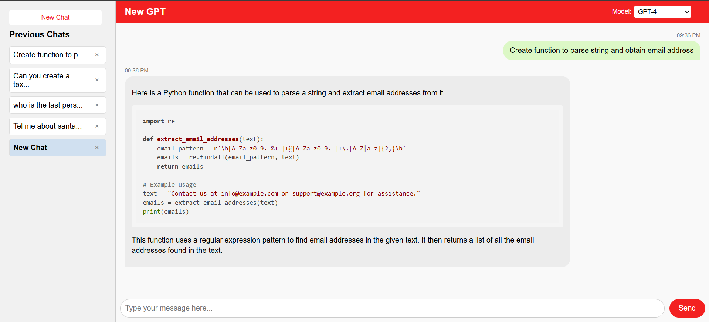

# Conversational App with Node.js and Express

A simple conversational web application built with Node.js and Express, integrating OpenAI's ChatGPT API to provide AI-powered chatbot functionality. The app features a responsive web interface with styled messages resembling a chat application.

## Table of Contents

-   [Features](#features)
-   [Demo](#demo)
-   [Prerequisites](#prerequisites)
-   [Installation](#installation)
-   [Usage](#usage)
-   [Project Structure](#project-structure)
-   [Customization](#customization)
    -   [Styling](#styling)
    -   [Chatbot Behavior](#chatbot-behavior)
    -   [Adding Features](#adding-features)
-   [Contributing](#contributing)
-   [License](#license)
-   [Acknowledgments](#acknowledgments)

----------

## Features

-   **AI-Powered Chatbot**: Communicate with an AI assistant using OpenAI's ChatGPT API.
-   **Responsive UI**: A clean and responsive chat interface built with HTML, CSS, and JavaScript.
-   **Message Styling**: User and bot messages are styled with speech bubbles and differentiated by alignment and color.
-   **Typing Indicator**: Simulates a typing indicator while awaiting the bot's response.
-   **Error Handling**: Graceful handling of API errors with user-friendly messages.

----------

## Demo

_Add a link to a live demo [TBD]._

----------

## Prerequisites

-   **Node.js**: Ensure you have Node.js (version 12 or higher) and npm installed. You can download Node.js from  [nodejs.org](https://nodejs.org/).
-   **OpenAI API Key**: Obtain an API key from  [OpenAI](https://platform.openai.com/).

----------

## Installation

1.  **Clone the Repository**
    
    
    `git clone https://github.com/your-username/conversational-app.git
    cd conversational-app` 
    
2.  **Install Dependencies**
    
    
    `npm install` 
    
3.  **Set Up Environment Variables**
    
    -   Create a `.env` file in the root directory:
        
        
        `OPENAI_API_KEY=your_openai_api_key_here` 
        
    -   Replace `your_openai_api_key_here` with your actual OpenAI API key.
        
4.  **Add `.env` to `.gitignore`**
    
    Ensure the `.env` file is ignored by Git to keep your API key secure.
    
    
    
    `echo '.env' >> .gitignore` 
    

----------

## Usage

1.  **Start the Server**
    
    
    `node server.js` 
    
    Alternatively, you can use `nodemon` for automatic restarts during development:
    
    
    `npm install -g nodemon
    nodemon server.js` 
    
2.  **Access the App**
    
    Open your web browser and navigate to:
    
    
    `http://localhost:3000` 
    
3.  **Interact with the Chatbot**
    
    -   Type your message in the input field at the bottom.
    -   Press  **Send**  or hit  **Enter**.
    -   The chatbot will respond, and the conversation will be displayed in the chat window.

----------

## Project Structure

```
conversational-app/
├── public/
│   ├── index.html
│   ├── styles.css
│   └── [additional static assets]
├── server.js
├── package.json
├── package-lock.json
├── .env
└── .gitignore
```
-   `public/`: Contains static files served by Express.
    -   `index.html`: The main HTML file with the chat interface.
    -   `styles.css`: External CSS file for styling.
-   `server.js`: The main server file containing the Express app and chatbot logic.
-   `.env`: Environment variables (e.g., OpenAI API key).
-   `.gitignore`: Specifies intentionally untracked files to ignore.

----------

## Customization

### Styling

-   Modify  `public/styles.css`  to customize the look and feel of the chat interface.
-   Adjust colors, fonts, and layout as desired.

### Chatbot Behavior

-   The chatbot currently uses OpenAI's `gpt-3.5-turbo` or `gpt-4` model.
    
-   To change the model or modify the behavior:
    
    -   Edit the API request in `server.js`:
        
        javascript
        
        ```// server.js
        require('dotenv').config();
        const express = require('express');
        const axios = require('axios');
        const app = express();
        const PORT = process.env.PORT || 3000;
        
        app.use(express.json());
        app.use(express.urlencoded({ extended: true }));
        app.use(express.static('public'));
        
        app.post('/chat', async (req, res) => {
          const userMessage = req.body.message;
        
          try {
            const apiResponse = await axios.post(
              'https://api.openai.com/v1/chat/completions',
              {
                model: 'gpt-3.5-turbo',
                messages: [{ role: 'user', content: userMessage }],
              },
              {
                headers: {
                  'Content-Type': 'application/json',
                  Authorization: `Bearer ${process.env.OPENAI_API_KEY}`,
                },
              }
            );
        
            const botReply = apiResponse.data.choices[0].message.content;
            res.json({ reply: botReply });
          } catch (error) {
            console.error(error.response ? error.response.data : error.message);
            res.status(500).json({
              reply: 'Sorry, there was an error processing your request.',
            });
          }
        });
        
        app.listen(PORT, () => {
          console.log(`Server is running on port ${PORT}`);
        }); 
        ```
-   Refer to [OpenAI's API documentation](https://platform.openai.com/docs/api-reference) for additional parameters.
    

### Adding Features

-   **Session Management**: Implement session tracking to maintain conversation context.
-   **Themes**: Add light/dark mode toggling.
-   **Input Validation**: Enhance validation for user inputs.
-   **Error Handling**: Customize error messages and handling strategies.

----------

## Contributing

Contributions are welcome! Please follow these steps:

1.  **Fork the Repository**
    
2.  **Create a Feature Branch**
        
    `git checkout -b feature/YourFeature` 
    
3.  **Commit Your Changes**
    
    `git commit -m 'Add a new feature'` 
    
4.  **Push to the Branch**
        
    `git push origin feature/YourFeature` 
    
5.  **Open a Pull Request**
    
    Submit your pull request for review.
    

----------

## License

This project is licensed under the [MIT License](https://cokechat.azurewebsites.net/c/LICENSE).

----------

## Acknowledgments

-   [Express.js](https://expressjs.com/)
-   [OpenAI API](https://platform.openai.com/)
-   [Axios](https://github.com/axios/axios)
-   [Node.js](https://nodejs.org/)
-   [nodemon](https://nodemon.io/)